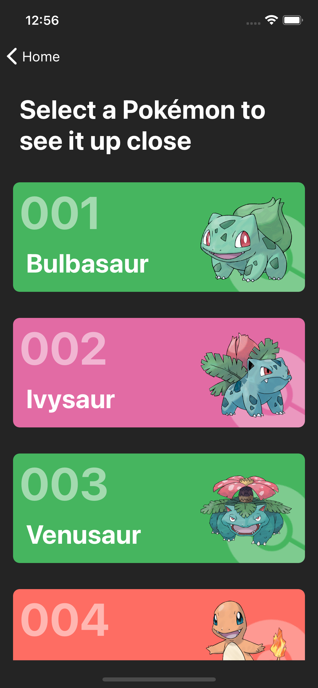
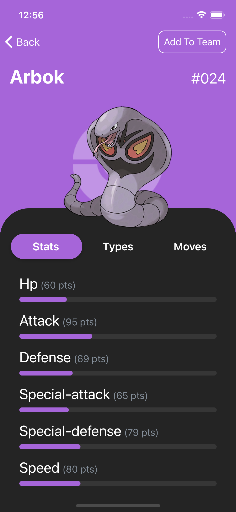

# Pokedex

This is a greenfield project I built with React Native. Here's a preview:

## Running The App

1. Install dependencies (see below)
1. Clone the repo
1. Run `yarn install` in project root
1. Run `npx react-native run-ios` or `npx react-native run-android`

This has been tested primarily on iOS emulators, iOS physical devices and Android physical devices.
No testing was done on Android emulators as this was developed on an M1 and support for those is still a bit behind.

## Things I Think Are Fun About This App

1. Local storage is used to persist a selection of Pokémon as part of "your team".
1. FlatList items are memoized.
1. The Pokémon index uses infinite scrolling.
1. Pokémon screen colors correspond to the Pokémon's main type.
1. The design turned out to be pretty cool, I think. Inspired by [this design](https://dribbble.com/shots/15424778-Pokedex-Mobile) by Daniel Motta.
1. A bit of research led me to discover [bastionbot.org](https://bastion.traction.one/) hosted Pokémon `.png`s with no background. Which was super fortunate.

## Architecture

- App Structure:
  - Models are data-holders
  - Facades are mostly ViewModels. Some might have Presenter characteristics.
  - General helpers are found in the `utils` directory
- Backend:
  - PokeAPI (REST) for Pokémon info
  - bastionbot.org for Pokémon images
- Client:
  - ReactNative with TypeScript
  - ESLint
  - Prettier is deactivated because it interfered with me wanting to do horizontal alignment, against Clean Code suggestions. Explained <a href="./.prettierignore" target="_blank">here</a>.
  - Jest for tests
  - react-query for HTTP requests

---

  
Dependencies

---

- Homebrew
- Node: `brew install node`
- Watchman: `brew install watchman`
- For iOS:
  - XCode
  - XCode Command Line Tools
  - iOS Simulator (Might come bundled with latest XCode)
  - Cocoapods
- For Android:
  - Java Development Kit
  - Android Studio
  - Android SDK
  - Android SDK Platform
  - Android Virtual Device

For specific instructions, visit React Native's [environment setup instructions](https://reactnative.dev/docs/environment-setup)

